🌟 Merchant Categorization with Clustering & NLP

An AI-powered system to categorize merchants from transactional data using NLP and clustering techniques!

🚀 Overview

This project categorizes merchants using:

    📚 FastText embeddings for textual representation
    🔄 UMAP for dimensionality reduction
    🛠️ HDBSCAN & KMeans for clustering
    🌈 WordCloud & Matplotlib for visualization

📂 Project Structure

```
merchant-categorization/
├── src/
│   ├── categorization.py   # Clustering logic (HDBSCAN & KMeans)
│   ├── model_training.py   # Main script for training & evaluation
│   ├── name_filtering.py   # Filters human names from merchants
│   ├── preprocessing.py    # Data cleaning & embeddings generation
│   ├── __init__.py         # Module initialization
├── configs.py              # Configurations (paths, parameters)
├── requirements.txt        # Python dependencies
├── README.md               # Documentation
├── .gitignore              # Ignoring unnecessary files
├── data/                   # Raw and processed data (optional)
├── reports/                # Generated reports & visualizations (optional)
└── notebooks/              # Jupyter Notebooks for analysis (optional)
```

📌 Features

    🌍 Text Preprocessing: Cleans merchant names, removes noise, and normalizes text.
    💡 Dimensionality Reduction: Uses UMAP to optimize clustering performance.

🌱 Clustering Algorithms:

    🌐 HDBSCAN: Density-based clustering with noise handling.
    🌍 KMeans: Classic clustering method for performance comparison.
    🎨 WordCloud Analysis: Visualizes common words in each merchant category.

🔧 Installation

Clone the repository and install dependencies:
```
git clone <repo-url>
cd merchant-categorization
conda init
conda create --name venv python=3.11
conda activate venv
pip install -r requirements.txt
```
📊 Running the Model

1️⃣ Train & Cluster Data
```
python src/model_training.py
```
2️⃣ Filter Merchant Names
```
python src/name_filtering.py
```
3️⃣ Preprocess Data & Generate Embeddings
```
python src/preprocessing.py
```
🔬 Results

UMAP + HDBSCAN Clustering

💡 Best parameter settings found:
```
n_neighbors = 10
n_components = 30
min_cluster_size = 500
min_samples = 50
```

Final Cluster Wordclouds
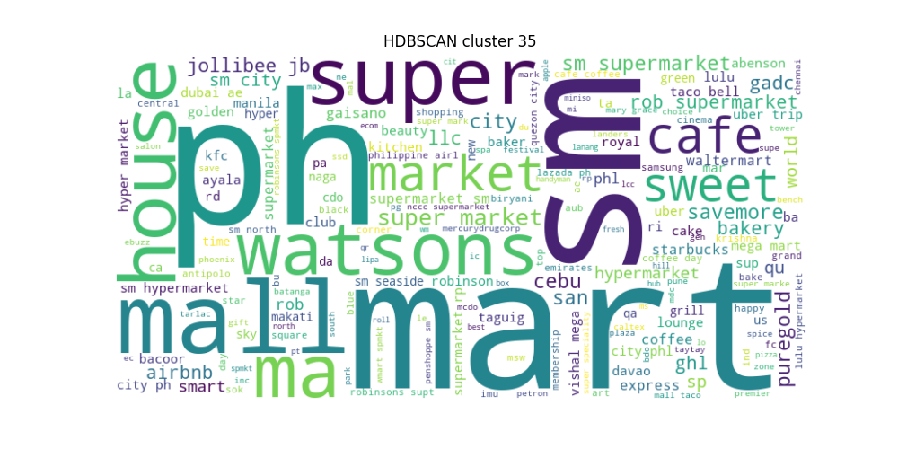
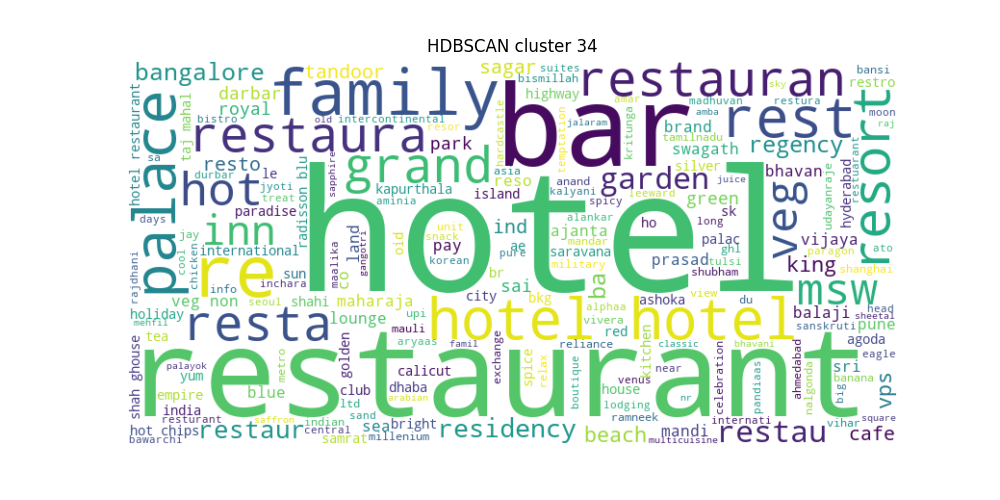
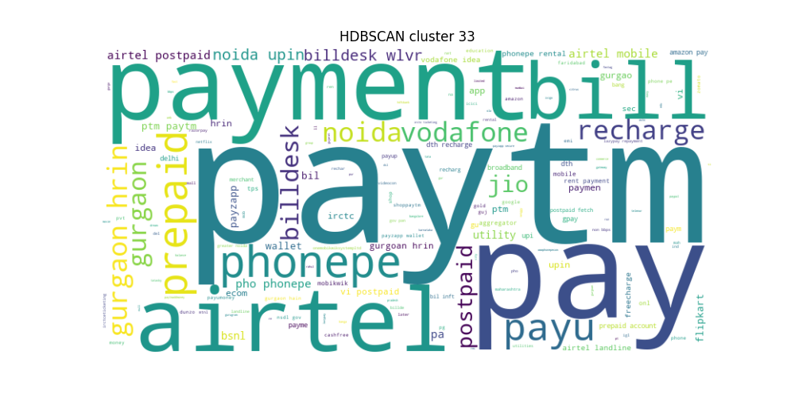
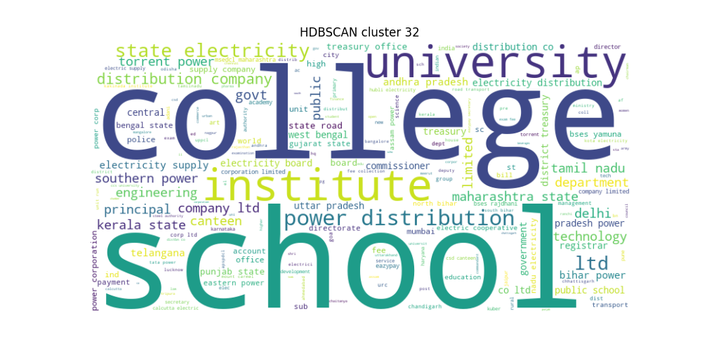

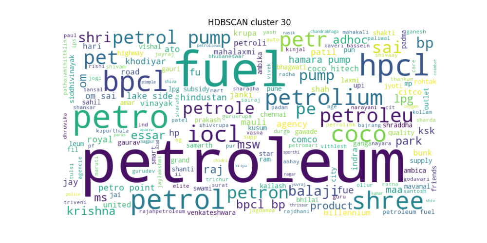


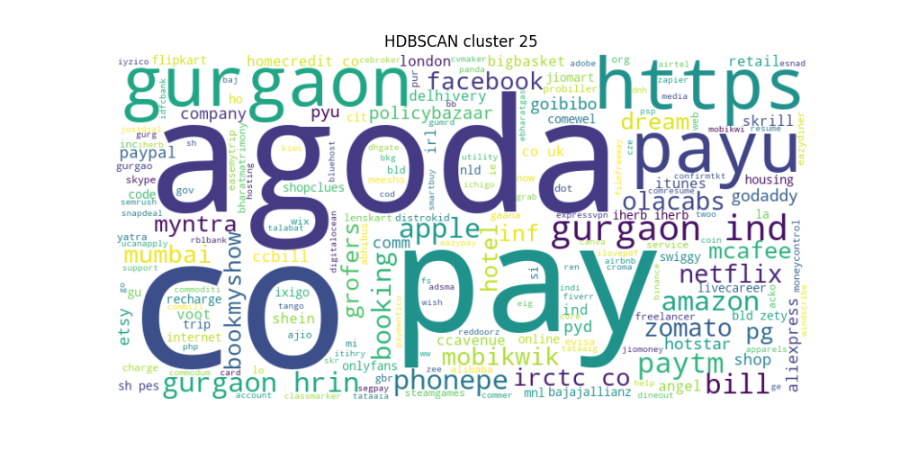
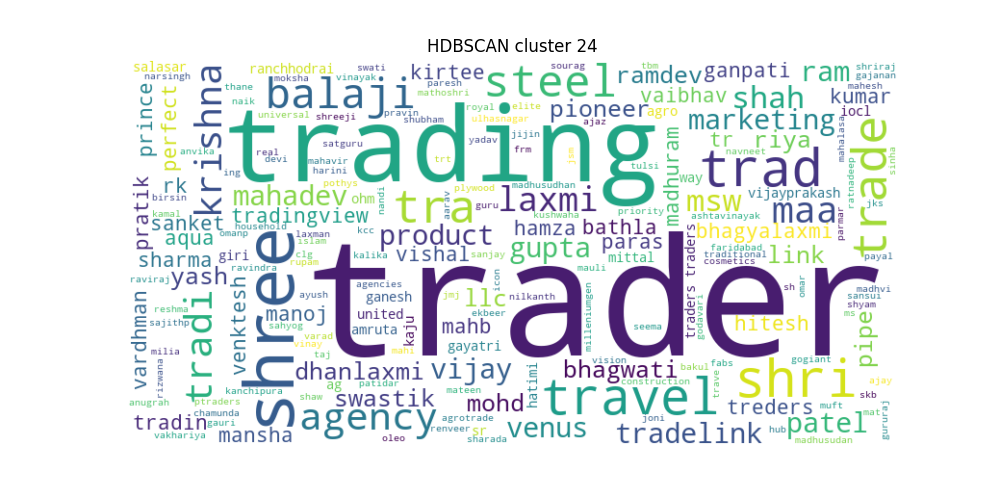
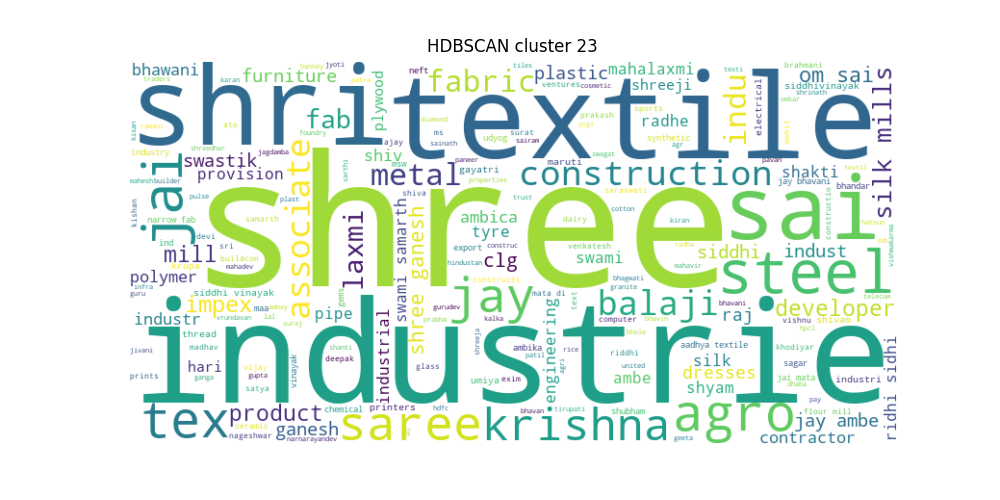
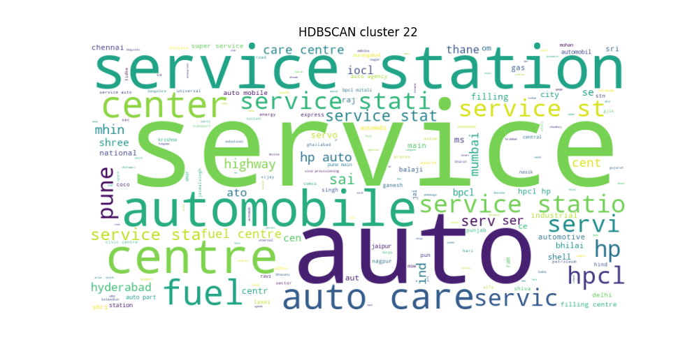
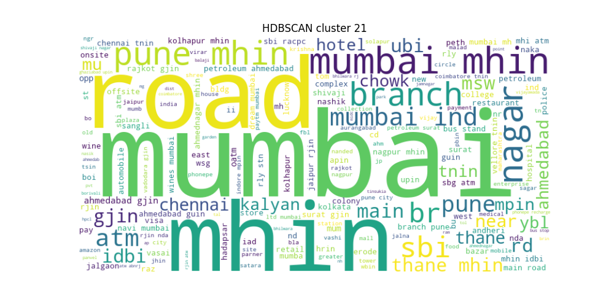
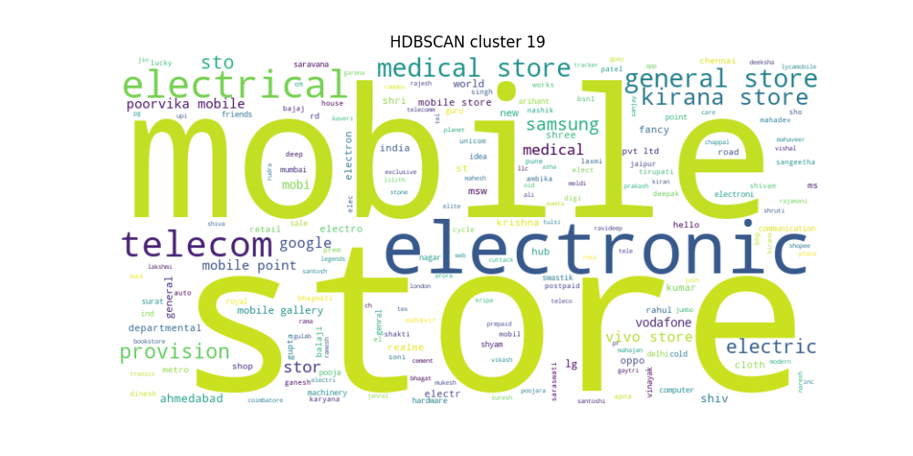
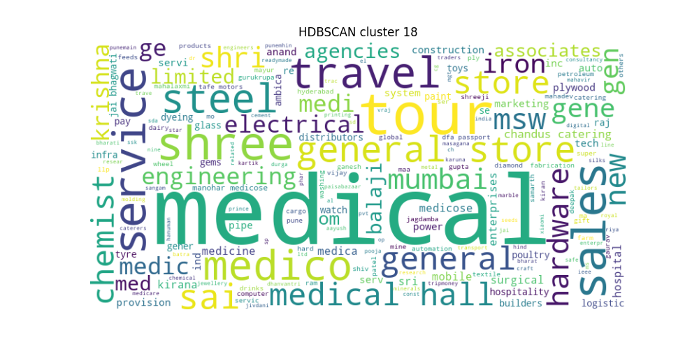
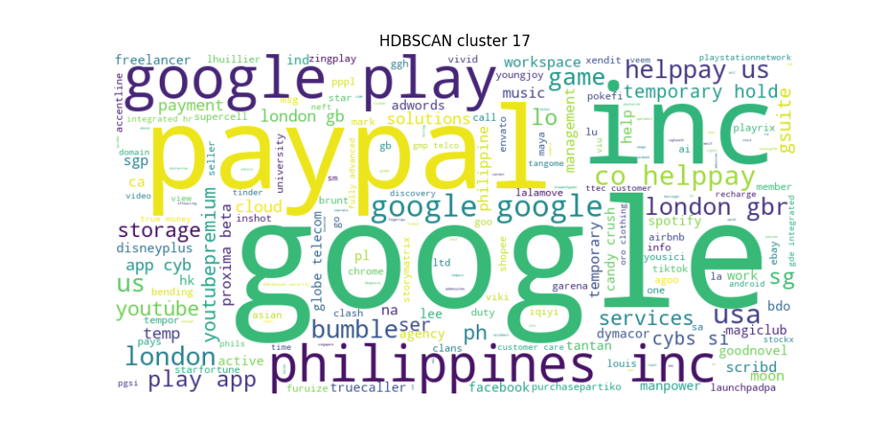
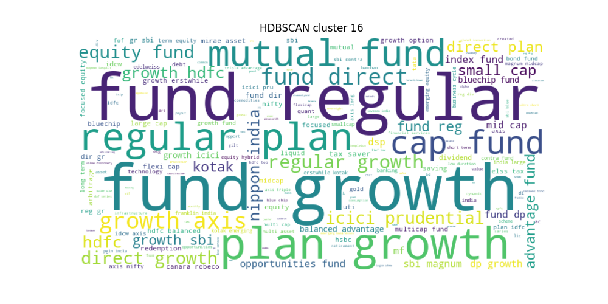
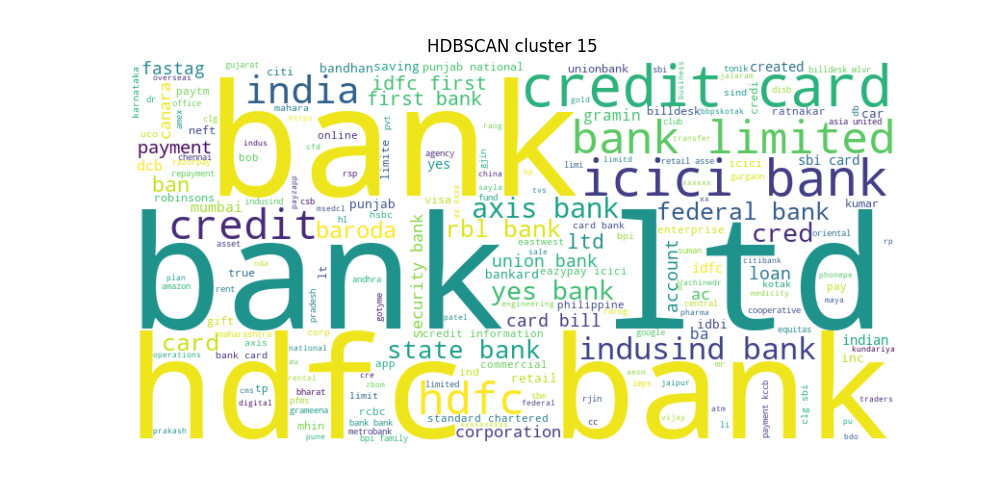
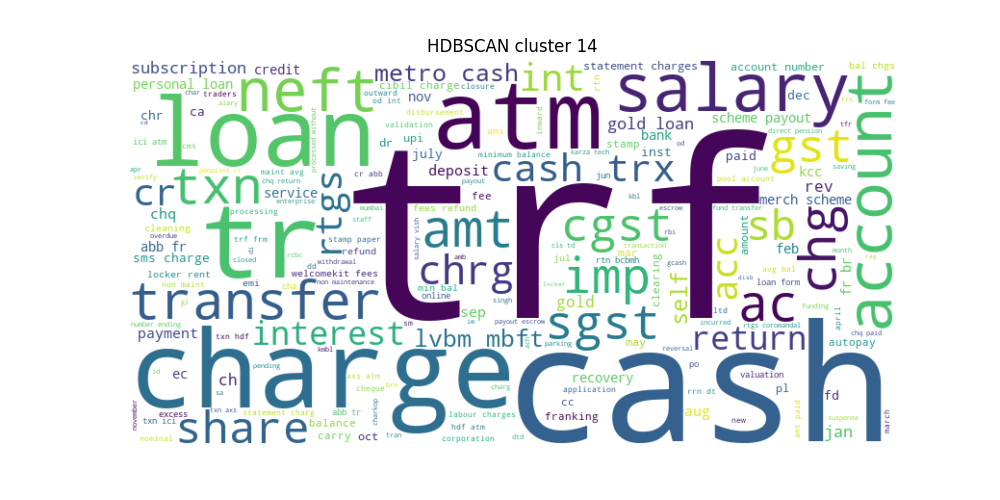
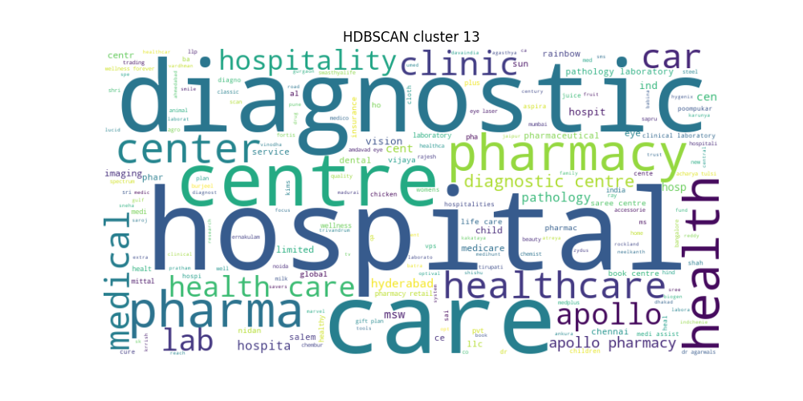
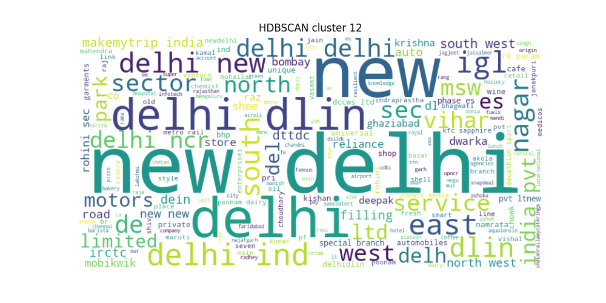
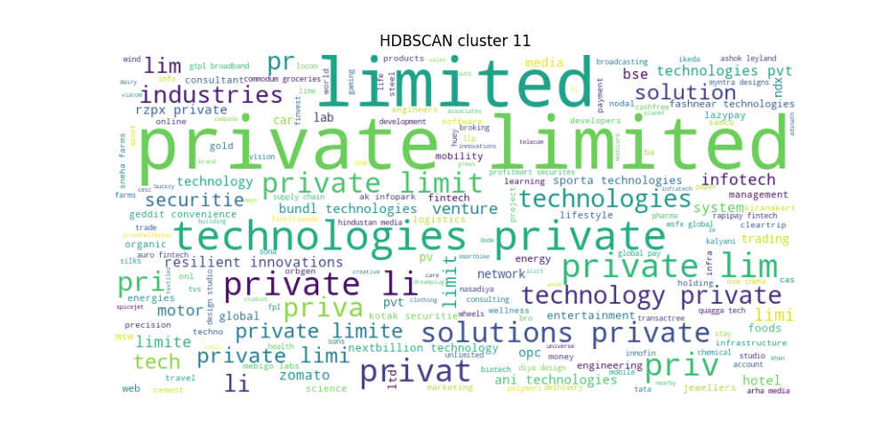
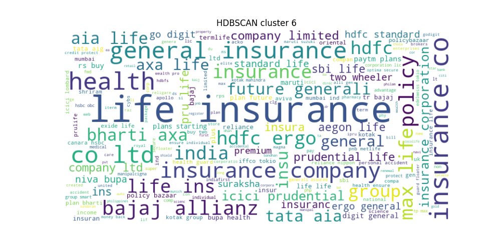
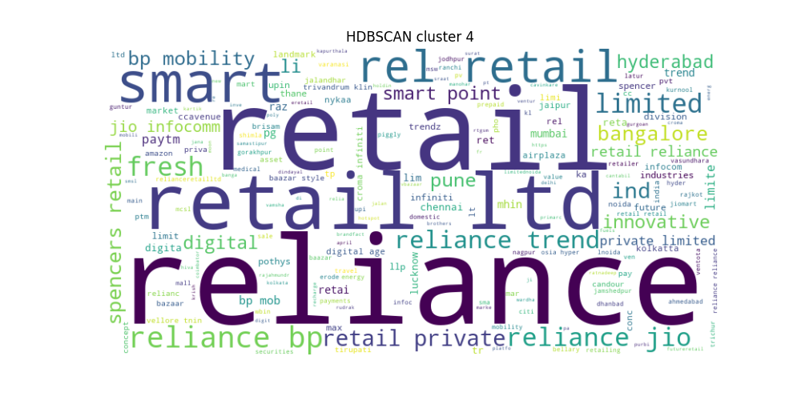


👤 Merchant vs. human name differentiation is a challenge.

    - 🔎 High noise (~0.45% of data) was observed.

KMeans Clustering

    - 💡 Currently being tested as an alternative to HDBSCAN.

📊 Visualization

    - Sample word cloud for a merchant cluster:


🔨 Fixes

    - Fix blank word-cloud issues
    - Fix vizualizations that are not working

🏆 Key Takeaways

    🔍 Filtering out human names is crucial – frequency-based & embedding-based methods explored.
    🚀 HDBSCAN provided robust clustering, but requires fine-tuning for best performance.
    📊 Silhouette scores and cosine matrix gives good results
    🔄 Next steps: Test KMeans, refine merchant filtering, and optimize embeddings.

📈 Future Work

    🌟 Improve merchant filtering by removing outliers via embeddings.
    💡 Optimize clustering hyperparameters for better silhouette scores.
    🔬 Explore topic modeling for more granular merchant categorization.
    🏷️ Name the cluster categories - check for heirarchies
    📊 Add clustering confidence for each row, generate wordclouds using high confidence data
    🔎 Analyse low confidence rows, may remove those rows from input data
    🧹 Check if some clusters have specifically clustered non-merchant names, may remove that cluster from input data
    🎯 Train final model on best input data
    🚀 Convert final clustering model into API solution that categorizes un-clean merchant names
    🔄 Compare with existing merchant categorization solution


🤝 Contributing

    👉 Fork the repo
    👉 Implement improvements
    👉 Submit a pull request

📧 Questions? Reach out at abhibak10@gmail.com